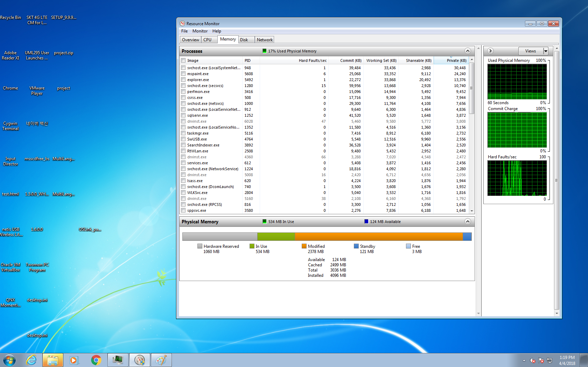
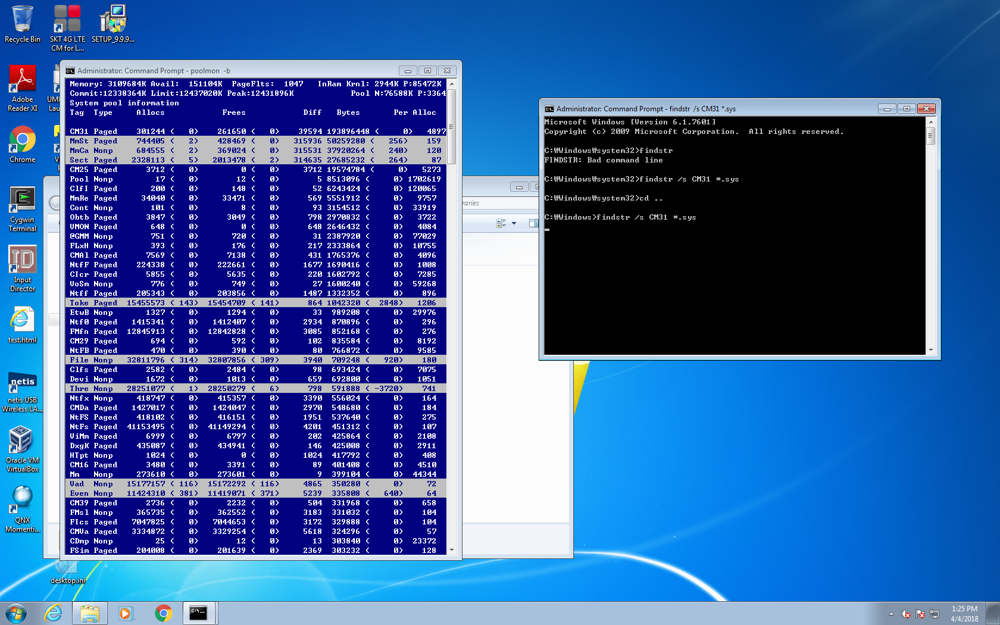
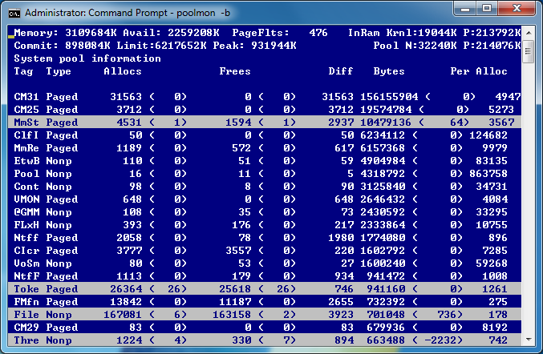

# Windows Memory Leak 분석

## 문제 발생, 현상

2018.4.4 오후 1시 경 가용 메모리를 모두 사용하여서 더이상 창이 뜨지 않고 아이콘도 뜨지 않는 현상 발생

## 문제 분석

poolmon을 통해 memory leak 여부 확인

## 모니터링

### 2018.4.4

리부팅 후 정상으로 돌아온것 확인하고 poolmon 상태 확인

* 최근에는 poolmon대신에 xperf를 사용해서 etl 로그를 생성하여 분석 하는 방법이 있다고 한다, 이를 통해 진행해볼 예정임

## References

* https://blogs.msdn.microsoft.com/ntdebugging/2012/08/30/troubleshooting-pool-leaks-part-2-poolmon/
* https://channel9.msdn.com/Shows/Defrag-Tools/Defrag-Tools-48-WPT-Memory-Analysis-Pool#time=08m22s