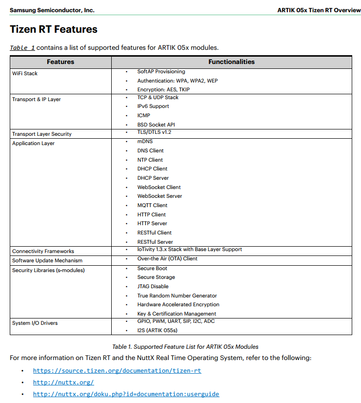

# 성결대 강의 2018.4.4 - Chapter3. Tizen RT

## 강의 목표

* TizenRT를 개요 수준으로 설명한다.
* 개발 시 필요한 API/정보를 찾을 수 있는 'How' 노하우 전달

## 강의 노트 : Tizen RT

### Tizen RT Overview
자세한 설명은 첨부 문서를 참고하고 아래는 그에 대한 요약입니다.\
[Download: Tizen RT Overview.PDF](https://developer.artik.io/downloads/3a6d6253-a28a-476d-97ba-3ba3d8bd537d/download)

Summary

* IoT(low end, low cost) 장치 지원 목적의 기존 Tizen 플랫폼 확장한 RTOS
* Cortex-M/R proessors with MPU, 2MB이하의 RAM, 16MB이하의 Flash메모리

Tizen RT is RTOS-based lightweight platform

* compact RTOS with built-in TCP/IP stack
* support for Lightweight Machineto-machine (LWM2M) protocol

The goal of Tizen RT

* extend the device coverage of Tizen platform to low-end devices

Applications

* smart TV, smartphone, wearable devices (Gear S, Gear Fit), and smart home appliances

limitations

* it cannot load additional modules in runtime
* it may be inferior to Linux environment

To tackle these limitations

* Tizen RT adopts Linux-style development environments
  * POSIX API, BSD Socket API, Shell, and Kconfig build configuration
* Tizen RT will adopt the lightweight JavaScript environment
  * JerryScript and IoT.js

Tizen RT consists of

* lightweight RTOS called TinyAra
  * TinyAra project was started in 2015, based on NuttX which is a real-time operating system (RTOS) with an emphasis on standards compliance and small footprint
  * IPv4/IPv6 network stack
  * File System
  * lightweight database called AraStorage
  * device monitor
  * IoTprotocols such as IoTivity (OCF) and LWM2M
* IoT Protocols : IoTivity and LWM2M, and JerryScript/IoT.js

### Tizen RT Software Architeture

### Tizen RT Features

https://source.tizen.org/documentation/tizen-rt/tizen-rt-1.0-specification

### Tizen RT APIs

https://source.tizen.org/documentation/tizen-rt/tizen-rt-apis

### Tizen RT 1.0 Specification

https://source.tizen.org/documentation/tizen-rt/tizen-rt-1.0-specification

### Tizen RT Long-term Goals

https://source.tizen.org/documentation/tizen-rt/tizen-rt-long-term-goals

* IoT JavaScript Framework
* S/W Updates : support non-Samsung device, OMA lightweight M2M (LWM2M)-based FOTA in 2017
* Fault Tolerance
* Memory Protection
* Microkernel Architecture
* Self-healing
* Configurability
* Support for Standard IoT Protocols
* Support for Low-end Wearable Bands

## TizenRT 실습

### 문서 찾기

처음보는 API를 숙지해나가는 과정을 보여주자

* SDK
  * SDK include - C:\ARTIK\SDK\A053\v1.7\libsdk
  * Examples - C:\ARTIK\SDK\A053\v1.7\examples
  * Sources - C:\ARTIK\SDK\A053\v1.7\source
* 문서
  * Public API - https://source.tizen.org/documentation/tizen-rt/public-api/
  * Libs and Environment - https://source.tizen.org/documentation/tizen-rt/libs-and-env/ 
  * OS Internals - http://nuttx.org/, C:\ARTIK\SDK\A053\v1.7\source\tinyara

### pthread API 사용하여 간단한 라이브러리 만들어보기

TDD(test driven development) 방식으로 간단한 함수를 만들어보자

* run_task : pthread 생성하고 종료할때까지 기다리는 기능 구현
* run_task_nowait : pthread 생성하는 기능 구현

Tizen RT 고찰

* pthread로 만든 쓰레드는 Tizen RT 내에서 어떻게 관리할까? - ps 명령어

### homework

* 강의 교재처럼 쓰레드를 여러개 생성해보기
* 강의 교재처럼 tash_cmd_install을 통하여 테스트 케이스 등록하기

## 특강

* 트렌드와 벡터
